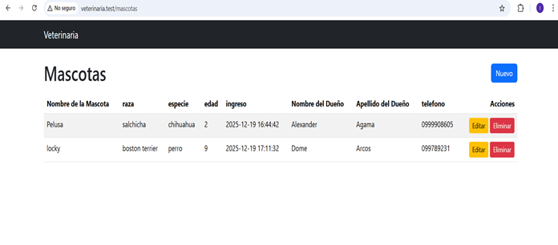
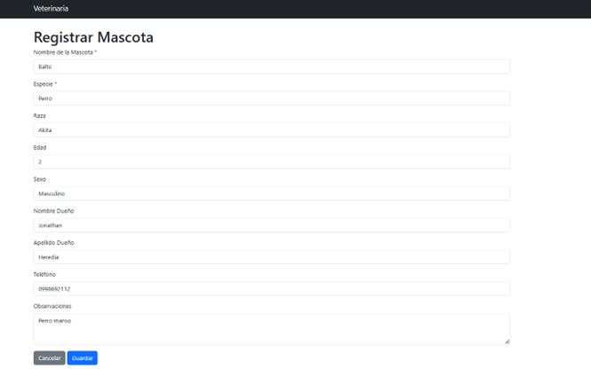
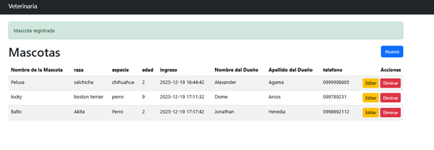
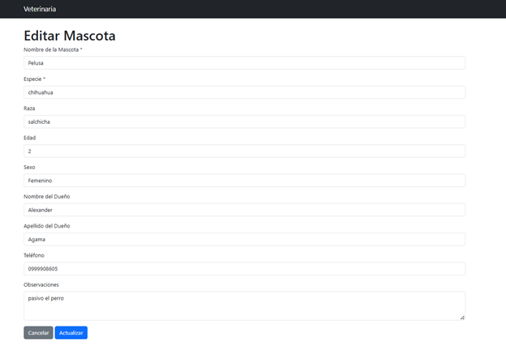
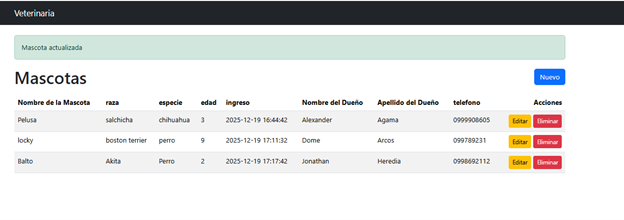
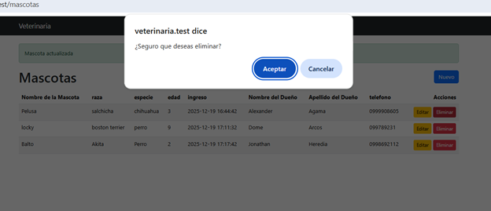
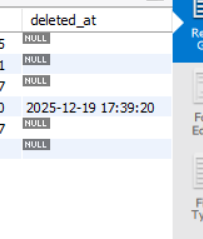
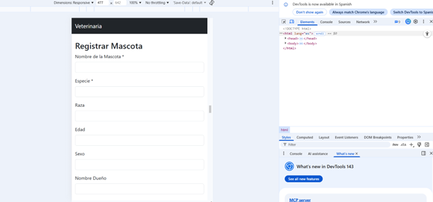

# Evaluacion– Desarrollo en Plataformas

**Estudiante:** Jonathan Heredia  
**Fecha:** 17/12/2025  
**Paralelo:** 2

---

## Mis Decisiones de Diseño

### 1. Tabla

**Nombre de la tabla:**  
`mascotas`

**Campos:**

| Campo | Tipo | ¿Obligatorio? |
|---|---|---|
| id | bigint (auto incremental) | Sí |
| nombreMascota | string(15) | Sí |
| especie | string(15) | Sí |
| raza | string(14) | Sí |
| edad | int | Sí |
| nombreDueño | string(15) | Sí |
| apellidoDueño | string(15) | Sí |
| telefóno | string(10) | Sí |
| observaciones | text(100) | No |
| estado | varchar(10) | Sí |
| created_at | timestamp | Sí |
| updated_at | timestamp | Sí |

---

### 3. ¿Se puede eliminar registros?

**Respuesta:**  
No se eliminan físicamente los registros.

**Razón (1 línea):**  
Se aplica borrado lógico mediante el campo `estado`, marcando los registros como INACTIVO para mantener el historial y la trazabilidad de la información porque también al leer del caso podemos considerar que las máscotas pueden morir y es una buena idea no borrar el registro sino dejarlo como inactivo y solo mostrar los activos.
## 📸 Capturas del Sistema

### Listado de mascotas

### Registro de mascotas

### Mascota registrado

### Edición de mascotas

### mascota actualizada

### Eliminación de  mascota (borrado lógico)

### mascota marcado como inactivo

###  deleted at en la base de datos

### Vista móvil

link del git
